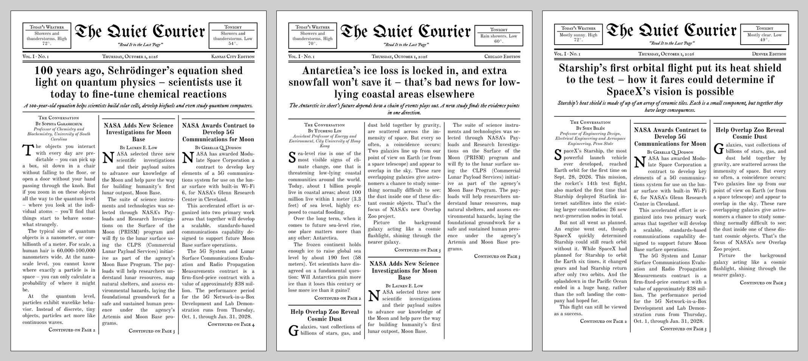

# The Quiet Courier

A daily newspaper for e-ink readers, laid out like an early-1900s broadsheet. Every article is written by people and is either public domain or openly licensed.



The name and motto are set in the edition data (`paper_name`, `motto`), so custom editions can carry a different masthead.

## Sample editions

Three city editions for Thursday, October 1, 2026, built from real articles published that week. Each city gets its own National Weather Service forecast, almanac, and a front page from a different 1926 newspaper.

| Edition | Lead story | From the Archives (Oct. 1, 1926) | Poem |
|---|---|---|---|
| Kansas City | Schrödinger's equation at 100 (The Conversation) | The Cordele Dispatch, Georgia | Keats, "To Autumn" |
| Chicago | Antarctic ice loss (The Conversation) | The Indianapolis Times | Frost, "October" |
| Denver | Starship's heat shield (The Conversation) | The Bismarck Tribune, North Dakota | Jackson, "October's Bright Blue Weather" |

Each edition renders three ways:

| File | Page size | Columns | For |
|---|---|---|---|
| `out/<city>_small.pdf` | 4.0 × 5.33 in | 2 | Kindle Paperwhite, Kobo Clara, other 6–7" readers |
| `out/<city>_large.pdf` | 6.2 × 8.27 in | 3 | Kindle Scribe, Boox Note, reMarkable |
| `out/<city>.epub` | reflowable | 1 | Any reader; Send-to-Kindle converts it |

More pages are in [docs/showcase](docs/showcase):

| | Kansas City | Chicago | Denver |
|---|---|---|---|
| Large, inside | [Science](docs/showcase/kansas-city-large-science.png) | [World](docs/showcase/chicago-large-world.png) | [Weather](docs/showcase/denver-large-weather.png) |
| Large, archives | [1926](docs/showcase/kansas-city-large-archives.png) | [1926](docs/showcase/chicago-large-archives.png) | [1926](docs/showcase/denver-large-archives.png) |
| Large, last page | [Puzzle](docs/showcase/kansas-city-large-last.png) | [Puzzle](docs/showcase/chicago-large-last.png) | [Puzzle](docs/showcase/denver-large-last.png) |
| Small, page 1 | [Front](docs/showcase/kansas-city-small-front.png) | [Front](docs/showcase/chicago-small-front.png) | [Front](docs/showcase/denver-small-front.png) |
| Small, page 2 | [Jump](docs/showcase/kansas-city-small-page2.png) | [Jump](docs/showcase/chicago-small-page2.png) | [Jump](docs/showcase/denver-small-page2.png) |

## Status

| Phase | State |
|---|---|
| 1. Newspaper design | Done |
| 2. Content pipeline | Done: `courier build` makes today's edition from live sources |
| 3. Website and registration | Live at quietcourier.com: landing page, email sign-in, setup, Kindle guide, account page, terms and privacy policy |
| 4. Delivery | Deployed, switched off until launch: every 15 minutes, 5 a.m. in each reader's time zone, retries, alerts, copies and monthly report for The Conversation |
| 5. Billing | Not started |
| 6. Launch readiness | In progress: admin page and counts done; launch waits for billing |
| 7. Monetization | Not started |

The sample editions above are rendered from content saved in `pipeline/samples/`. Editions built with `courier build` use whatever the sources published that day.

## Repository layout

```
assets/fonts/        Fonts and their licenses (all SIL OFL 1.1)
pipeline/            Python: fetch, clean, select, lay out, render
  courier/           The package
  templates/         Print HTML/CSS (Jinja) and EPUB templates
  courier/sources/   One module per source, all returning the same article shape
  courier/data/      Poem library, serial novel list, and the English word list used to score OCR
  samples/           Sample edition data and images
  tests/             Offline: every source is tested against saved copies of its feed
  courier.toml       Paper name, reading length, cities, which sources are on
docs/                Source licensing notes, showcase images
web/                 Next.js site: sign-up, accounts, setup guide
  app/               Pages and server actions
  lib/server/        Sign-in, sessions, rate limits, mail, account changes
  db/                Drizzle schema and SQL migrations
deploy/              systemd unit, nginx site, deploy and backup scripts
docs/OTHER_READERS.md  Kobo, Boox and reMarkable delivery options
```

## Setup

Needs Python 3.11+ and Pango (WeasyPrint uses it for text layout).

- Arch: `sudo pacman -S pango`
- Debian/Ubuntu: `sudo apt install libpango-1.0-0 libpangoft2-1.0-0`
- macOS: `brew install pango`

```sh
python -m venv .venv
.venv/bin/pip install -e "pipeline[dev]"
.venv/bin/python -m courier sample           # renders every edition in pipeline/samples/ into out/
.venv/bin/python -m pytest pipeline          # about 40 seconds
```

`--edition pipeline/samples/denver.json` renders one edition (repeatable). `--device small|large` renders one size. `--no-epub` skips the EPUB.

### Building today's real edition

```sh
export COURIER_CONTACT_EMAIL=you@example.com   # sent to the Weather Service and Library of Congress, which ask for a contact
.venv/bin/python -m courier build              # every city in courier.toml
.venv/bin/python -m courier build --city denver --date 2026-10-01
.venv/bin/python -m courier build --general --tz Asia/Tokyo           # no local weather
.venv/bin/python -m courier build --place gn-2996944 --name Lyon --region France \
    --country FR --lat 45.74846 --lon 4.84671 --tz Europe/Paris          # any place, by GeoNames id
```

An edition is keyed by `general`, a GeoNames id (`gn-<id>`), or a city id from `courier.toml`. Files go to `out/<date>/<key>/<key>_small.pdf`, `<key>_large.pdf` and `<key>.epub`. The website stores each reader's choice in those same terms.

Output goes to `out/<date>/<city>/`: `edition.json`, the two PDFs and the EPUB. Every edition, every article in it with its license and attribution, and whether each source succeeded are recorded in `data/courier.db` (SQLite; the schema in `pipeline/courier/schema.sql` is plain SQL so it can move to Supabase). Feeds are cached in `out/cache/<date>/`, so rebuilding the same day does not refetch.

The list of 1926 issues for each edition date is read from `pipeline/courier/data/archive-index.json.gz` (see [docs/SOURCES.md](docs/SOURCES.md) for why). It covers edition dates through 2027. To extend it, from a network loc.gov doesn't block (about 30 minutes a year, it waits between requests):

```sh
.venv/bin/python -m courier archive-index --from 2028-01-01 --to 2028-12-31
```

## Delivery

`courier deliver` runs every 15 minutes from a systemd timer on the server (see [docs/DEPLOY.md](docs/DEPLOY.md)). It reads readers from the site's Postgres database.

| | |
|---|---|
| When | Editions are built from 4 a.m. in each reader's time zone and emailed from 5 a.m. Each reader gets the edition for their own local date. |
| What is built | One article selection per date, shared by every edition. Then one edition per place that has readers, in only the formats they use. |
| Once only | One row per reader per date in `deliveries`. A row marked sent is never sent again, and each email carries an idempotency key, so a crash between sending and recording can't send twice. |
| Retries | A failed send is retried once an hour until 10 a.m., five tries in all. Then the owner gets an alert email. |
| Missing parts | If The World in Brief, a city's weather or the 1926 archives can't be had, the edition goes out without that part and no gap is shown. The owner gets one email per part per day, with the reason. |
| Limits | Sending stops for the run when the Resend plan's daily or monthly limit is close, keeping room for sign-in links. |
| The Conversation | After the first reader receives a date's edition, one copy goes to The Conversation listing their articles. On the 1st of each month, a report lists every article used, the dates it ran, and the circulation. Both are recorded so they go once. |
| Weekly upkeep | `courier maintain` runs on Sundays. It downloads the latest 1926 archive index from this repo, which the monthly "Archive index" GitHub workflow extends about six weeks at a time to stay 13 months ahead (loc.gov blocks the server, not GitHub). It adds up to 30 new public-domain poems from Wikisource collections listed in `pipeline/courier/poem_refill.py` (each page is read once; poems that are too long, too short, not English, published 1931 or later, or too thin for a word search are turned down). Poems don't repeat within a year. It keeps the next two serial novels downloaded and cut into instalments. It then emails the owner only if something is low: the 1926 archive index ends within 90 days, fewer than 30 poems are unused, fewer than 3 serial novels are left, a serial book was turned down that week, or disk is under 5 GB. |
| Setup reminder | The delivery job emails the account address once, a day after sign-up, if setup wasn't finished or the delivery address was never confirmed. Accounts older than a week are skipped, paused ones too, and `users.setup_reminder_sent_at` makes sure it's sent only once. It counts against the email quota. |
| Puzzles | A page before the last one carries a sudoku and a cryptogram (`courier/puzzle.py`). The sudoku is generated from the date, always has exactly one solution, and gets harder through the week: 38 givens on Monday down to 28 on Saturday. The cryptogram enciphers a whole sentence (40 to 90 letters) from a pool poem other than the day's, with no letter standing for itself and one letter given as a hint. If the cryptogram would push the page past one page in a format, that format leaves it out for the day. There is no answer sheet. |
| Daily serial | One instalment a day of a public-domain novel, from the list in `pipeline/courier/data/serials.json` (24 books, about five years). `courier/serial.py` strips Project Gutenberg's header, footer and name, finds the chapters (a heading followed by prose; contents pages are skipped), checks the chapter numbers run in order, and cuts the text into instalments of about 1,200 words (1,600 at most) at paragraph breaks. Instalment n of a book runs on its start date plus n − 1, so every edition of a date carries the same instalment however the builds are ordered. The next book starts the day after one ends. The instalment's words come out of the news budget, so an edition stays at 15 to 20 minutes. |
| Off switch | Nothing is sent unless `DELIVERY_ENABLED=1`. |
| Clean-up | Editions older than 14 days are deleted. |

Without `RESEND_API_KEY`, every email is written to `out/outbox/` instead of being sent.

The delivery tests run against an in-memory Postgres with the site's real migrations, so they need `npm ci` in `web/` first. Without it they are skipped.

## Website

Needs Node 20.9+ and PostgreSQL.

```sh
cd web
npm ci
cp .env.example .env        # set DATABASE_URL; leave RESEND_API_KEY empty in development
npm run db:migrate
npm run dev                 # http://localhost:3000
npm test                    # about 5 seconds, runs against an in-memory Postgres (PGlite)
```

Without `RESEND_API_KEY`, development prints every email (sign-in links included) to the server log instead of sending it. In production a missing key is an error.

Readers pick any city or town in the world from the GeoNames list, or a general edition with no local weather and a time zone. Load the list once, and again whenever you want fresher data (about a minute, 11 MB download):

```sh
npm run db:places
```

The city only changes the forecast and the almanac. Test editions are read from `EDITIONS_DIR`: the reader's own newest build, then the newest general edition, then the samples in `out/`.

### Accounts and security

| | |
|---|---|
| Sign-in | One email form for new and returning readers, with the same response either way, so it never reveals whether an address has an account. The link carries a 256-bit token in the URL fragment, so it stays out of server logs and mail scanners can't use it up by prefetching. It is stored as a SHA-256 hash, works once, and expires in 15 minutes. |
| Sessions | Random token in an `HttpOnly`, `SameSite=Lax` cookie (`__Host-` prefixed and `Secure` in production), stored hashed, 60-day lifetime. "Sign out on every device" deletes them all. |
| Rate limits | Sign-in emails: 5 an hour per address, 20 an hour per IP. Link redemption: 30 per 15 minutes per IP. Test editions: 3 a day. Delivery confirmations: 5 a day. Download links: see below. Stored in Postgres, so they survive restarts. |
| Download link | Readers without an email inbox (Kobo, reMarkable, Boox) choose a download link instead. `/read/<token>` serves their latest paper, `/read/<token>/<date>` an earlier one from the last 14 days, and `/read/<token>/opds` an OPDS feed for KOReader. The token is the user id plus an HMAC over it and `read_link_version`, keyed by `READ_LINK_SECRET`, so the account page can show it again and nothing usable is stored. "Make a new link" bumps the version and the old link stops working. Only papers the delivery job recorded for that reader are served. 20 bad tokens an hour per IP, 120 requests an hour per link; downloads go to the audit log. The delivery job records these readers' papers at 5 a.m. without sending mail, which starts the trial and counts toward circulation. |
| Delivery address | `@kindle.com`, `@free.kindle.com` and `@pbsync.com` only accept mail from approved senders, so they are trusted as entered. Any other address must open a confirmation link before anything is sent there. |
| Terms | Accepted with an unticked checkbox during setup. The version and time are stored. |
| Audit log | Sign-ins, failures, throttling and account changes, with IP, kept 90 days. No email addresses or names. |
| Admin page | `/admin` shows reader counts, the last 30 days of sign-ups, pauses and deletions, deliveries and failed sends, recent editions to download, and what was sent to The Conversation. Only addresses in `ADMIN_EMAILS` can open it; everyone else gets the normal 404. Views and downloads are written to the audit log. The figures come from the database, with no tracking on the pages. |
| Headers | CSP with a per-request script nonce, `frame-ancestors 'none'`, `nosniff`, a strict referrer policy. HSTS comes from nginx. Server action bodies are capped at 32 KB. |

Deleting an account removes the row and its sessions and tokens. Nightly backups are kept 30 days.

### Billing

Off until `BILLING_ENABLED=1` is set in both `web/.env` and `pipeline.env`. Until then nothing is charged and the site says so.

| | |
|---|---|
| Free trial | 14 days, no card. It starts with the first paper delivered, so days spent waiting for launch don't count. When it ends the paper stops unless the reader subscribed. Nothing is ever charged automatically after a trial. |
| Reminder | Three days before the trial ends, one email says the paper is about to stop and links to `/subscribe`. |
| Subscribing | `/subscribe` shows the price, the first charge date and the renewal terms, with an unticked checkbox, then hands off to Stripe Checkout. Subscribing during the trial keeps the free days: the first charge is on the day they end. The price comes from `STRIPE_PRICE_ID` on the server. |
| Confirmation | After checkout, an email repeats the price, renewal and how to cancel, as the auto-renewal laws require. |
| Managing | "Manage billing" on the account page opens Stripe's customer portal for card changes and cancelling. |
| Webhooks | `/api/stripe/webhook` checks Stripe's signature, records each event id so a redelivered event is applied once, and always reads the subscription back from Stripe so events arriving out of order can't leave stale state. |
| Who gets a paper | With billing on: readers whose trial hasn't started or hasn't ended, and readers whose subscription is `trialing`, `active` or `past_due` (Stripe is still retrying the card). |
| Deleting an account | Cancels the subscription at Stripe first. If Stripe can't be reached, nothing is deleted. |

### Referral links (planned, not built)

Lets outside accounts (a newspaper's Instagram, a blog, a forum, a creator) send readers with their own link, and pays each one a fixed amount for every reader who goes on to pay. Any number of referrers can run at once, each with its own numbers, terms and money owed. Built the day the first referrer agrees; nothing below exists in the code yet.

Two ideas are kept separate:

- A **referrer** is who gets paid (The Daily Cougar, a YouTuber). It holds the terms and the money.
- A **link** is a code that belongs to one referrer. A referrer can have several (`/via/cougar` for the Instagram bio, `/via/cougar-story` for a story) to see which post worked. Everything is totalled per link and per referrer.

| | |
|---|---|
| Link | `https://quietcourier.com/via/<code>`, e.g. `/via/cougar`. Codes are lowercase `[a-z0-9-]{2,32}` and never reused, even after a referrer ends. A code that is active sets a first-party cookie `qc_ref` (`HttpOnly`, `Secure`, `SameSite=Lax`, 30 days) and redirects to the home page. Unknown, paused or ended codes redirect without a cookie. The route is rate limited like sign-in. |
| Attribution | First touch wins and is never overwritten. The sign-in form reads `qc_ref` and stores the code on the email token, so it survives the sign-in link being opened on another device or in a mail app's browser. `completeSignIn` copies it to the new user. Existing accounts are never attributed. |
| Paying reader | The first `invoice.paid` with an amount above zero for a referred user writes one row to `referral_conversions`, with the payout copied from the referrer's terms at that moment, so changing a rate later never rewrites past months. A refund of that invoice (`charge.refunded`, added to the webhook's events) marks it void; if it was already paid out, the next statement shows it as a deduction. Trial sign-ups who never pay cost nothing. |
| Terms per referrer | `payout_cents` per paying reader (below the price, so card fees are covered), optional `max_payouts` cap, `starts_at` and `ends_at`. Readers who arrive after `ends_at` aren't attributed; readers attributed before it still count when they pay. |
| Clicks | Counted per link per day in one row (`referral_clicks`). No IP, user agent or reader identity is stored for a click. |
| Disclosure | Each referrer's post must be marked as paid ("Sponsored" or Instagram's "Paid partnership"), as the FTC requires. The agreement (rate, cap, dates, disclosure) is confirmed in writing and its date stored on the referrer. |
| Privacy | The privacy policy gets one line on the `qc_ref` cookie: what it holds, that it's first-party and expires in 30 days. No third-party trackers. |

Admin pages, all behind the existing `ADMIN_EMAILS` check and written to the audit log:

| Page | What it does |
|---|---|
| `/admin/referrals` | One row per referrer: status, links, clicks, sign-ups, finished setup, in trial, paying, voided, earned, paid out, owed. Totals row at the bottom. Filter by month. |
| `/admin/referrals/new` | Add a referrer and its first link: name, contact, payout, cap, dates, agreement date. Shows the finished link to copy. |
| `/admin/referrals/<id>` | One referrer: the same figures per link and per month, edit terms (applies to future conversions only), add a link, pause or end. |
| Record payout | A form on the referrer page: amount, date, method, note. Owed = earned − voided − paid out, never below zero; an overpayment carries to the next month. |
| Statement | Per referrer per month, as a page and a CSV, ready to send them: clicks, sign-ups, paying readers, voided, amount earned, paid, still owed. Dates and counts only, no names or emails. |
| Accounting export | One CSV of every payout to every referrer for a year, for Schedule C. Referrers who are individuals and pass $600 in a year need a W-9 on file and a 1099-NEC; the referrer page shows a warning as they approach it. |

Tables:

- `referrers`: `id`, `name`, `contact`, `kind` (`organization`/`individual`), `payout_cents`, `max_payouts`, `starts_at`, `ends_at`, `paused_at`, `agreed_at`, `w9_on_file`, `created_at`.
- `referral_links`: `code` (primary key), `referrer_id`, `label`, `created_at`, `disabled_at`.
- `users`: new nullable `referred_by` (references `referral_links.code`) and `referred_at`. `email_tokens`: new nullable `referral_code`.
- `referral_clicks`: `code`, `day`, `count`, primary key (`code`, `day`).
- `referral_conversions`: `user_id` (unique), `code`, `referrer_id`, `stripe_invoice_id` (unique), `amount_cents`, `payout_cents`, `paid_at`, `voided_at`.
- `referral_payouts`: `id`, `referrer_id`, `amount_cents`, `paid_on`, `method`, `note`, `created_at`.

Tests: link with an active, unknown, paused and ended code; attribution across devices through the token; first touch kept; existing account not attributed; only the first paid invoice counts and a redelivered webhook doesn't count twice; the cap stops new conversions; a rate change leaves past conversions alone; refund before and after payout; two referrers' figures never mix; owed never negative; admin pages 404 for non-admins; statement and accounting CSV totals match the tables.

### Deploying

The site runs on the same server as the other self-hosted sites, behind nginx, as its own `courier` user on 127.0.0.1:3200. See [docs/DEPLOY.md](docs/DEPLOY.md).

## How an edition is put together

| Step | What happens |
|---|---|
| Fetch | The Conversation, Global Voices, NASA and NASA Earth Observatory, the National Weather Service, and the Library of Congress are fetched in parallel. Each has a timeout and three tries. |
| Check licenses | The Conversation entries must state CC BY-ND in the feed. Global Voices stories republished from partner outlets are skipped. NASA images are kept only when the credit is NASA's alone. Archive pages must be from 1930 or earlier. |
| Clean | HTML is reduced to paragraphs and subheads. Players, share bars, contact blocks and navigation are removed. Anything removed from a story is listed in its credit line ("Images and audio omitted. Text unedited."). |
| Score OCR | 1926 pages come as scanned text. Each story is scored against an English word list; only clean ones run, and unreadable words print as [illegible]. |
| Select | A lead, two short front-page stories, one World, two Science, an optional Weather feature and up to four archive items, fitted to 4,800 words (about 20 minutes at 240 words a minute). Stories used in the last 60 days, near-duplicate headlines, and stories mentioning words in the `avoid` list are skipped. |
| Weather | US places use the National Weather Service. Everywhere else uses MET Norway, grouped into day and night periods in local time, in °C (°F in the US). A general edition has no weather and no local almanac. |
| Fall back | A source that fails is logged and skipped. US weather falls back to MET Norway. The lead falls back from The Conversation to Global Voices to NASA. With no forecast, the masthead shows sunrise and sunset. The build only fails if there is nothing at all to print. |

Turn a source off in `courier.toml` (`conversation = false`) and the paper is built without it.

## How the layout works

- Page size equals the reader's physical screen, so 8.6 pt type on the small edition is 8.6 pt on the device. Kindle and Boox fit a PDF page to the screen, so a page of the same shape shows without zoom or letterboxing.
- The front page must fit on one page. The renderer searches for the largest amount of the lead story that fits, cutting at a sentence boundary, and prints "Continued on Page N" with the real page number. The rest runs inside under "Continued from Page One".
- On the small edition, the lead runs alone on page one. At a readable type size there is no room for a second headline. The other front-page stories run in their sections.
- Each section starts on a new page. The last page is always the puzzle, the almanac, and "That's all for today". The build fails if that page overflows instead of shipping a broken edition.
- Monochrome only. No gray text and no rules thinner than 0.8 pt. Images are converted to a coarse black-and-white dither that reads like a newsprint halftone.
- Splitting a story across a jump never changes its text. A test checks every possible split point against the original, because The Conversation's CC BY-ND license forbids edits.

## Fonts

| Font | Use | License |
|---|---|---|
| UnifrakturMaguntia | Nameplate, closing line | SIL OFL 1.1 |
| Old Standard TT | Body text and headlines | SIL OFL 1.1 |
| IM Fell DW Pica | Drop caps, decks | SIL OFL 1.1 |
| IM Fell English SC | Section heads, bylines | SIL OFL 1.1 |

All from the Google Fonts repository. OFL allows commercial use and embedding in PDFs and EPUBs. License texts are in `assets/fonts/`.

## Content sources

See [docs/SOURCES.md](docs/SOURCES.md) for what was checked about each source's license, and what is still open.
